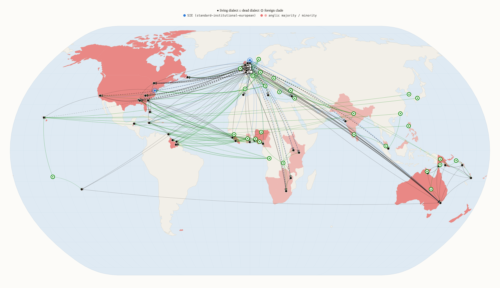

# Wordhoard

A public domain corpus of texts in 32 Anglic dialects.
There are two categories:

1. Living
2. Dead

A dialect is considered dead when its center of gravity is in a text rather
than a people. Depending on the category the corpus was provided differently.

For dead dialects these are excerpts from the text(s) that made it through the gauntlet of
history, be it Beowulf, The Canterbury Tales or The Tempest. Dead, or surviving text, dialects
were named by proxy from the authors or the texts in question. Which is how we end up with
Shakespearean or King James English if you will. I shudder at the thought of names such
as "Early Modern English" and so would the greats that made me appreciate the written word.
A great debt is owed, and will still be owed after this, to J.R.R. Tolkien, George Orwell and Chuck Palahniuk.

For living dialects many approaches were tried and failed. When it comes to non-institutional speech
the commons provides slim pickins. Slimmer still when looking for dialects or cross-dialect corpora.
As such these were synthesized via LLM (Claude Sonnet 5s orchestrated by Fable). Synthetic text, is, in theory at least,
pretty ideal, since I can custom fit it to a template. Which I did. Scenario 1 for all 26 living is a birth, appropriately.
This gets a very large confound out of the way. Normally I think people use The Bible or The Universal Declaration of Human Rights or The Little Prince,
something that has been translated aplenty. Unfortunately these tend towards institutional and even when they don't, they tend towards what I call
the "anchor" dialect of a clade, be it Californian for English (Anglic!) or Parisian for French. Dialects in fact rarely have
a lot of textual representation and when they do it's intermixed. In Mark Twain stories for example the anchor takes
the narration and the rest of the dialects get some dialog lines depending on character. As I don't actually speak most of these
dialects you should expect imperfections. I hope nothing as atrocious as advising pebbles be hidden in peanut butter.
Then again, I didn't read the full corpus. So your mileage, and peanut butter, may vary. (please open an issue if you see mineral rich diet recommendations)

Here is what that looks like in practice. Scenario 112 in two of the voices:

> [!NOTE]
> **California English**
>
> The traveler: Hey, so how much to get to the 405, like near the airport exit?
>
> The driver: Twenty, easy.
>
> The traveler: Twenty? Nah, come on, I'll do twelve.
>
> The driver: Twelve? Dude, that's kinda insulting, gas alone is basically that.
>
> The traveler: Okay okay, my bad. Sixteen?
>
> The driver: Yeah, sixteen works. Get in, we're good.

> [!NOTE]
> **Aberdeen Scots**
>
> The traveler: Fit like! Fit wid ye tak tae rin us doon the road?
>
> The driver: Twenty, nae bother.
>
> The traveler: Twenty? Awa ye go, that's affa dear. Twal, and I'm in.
>
> The driver: Twal? Ye'll hae me workin for nithin, chiel, that's nae richt.
>
> The traveler: Fit'll ye settle for then?
>
> The driver: Saxteen, and dinna fash yersel ony mair.
>
> The traveler: Saxteen it is. Hop in then, we're aff.

I included some maps I made trying to chart the Anglic clade as well.

Disclaimer: Neither the maps nor the corpus are complete. Early on, I actually had dreams of charting the full depth
of human communication, but alas my token budget was much, much, much more humble.

Post-Scriptum: Standard Institutional European is a clade that has 2 dialects within what the mainstream considers Anglic,
namely Washington and Commonwealth Standard Institutional European. This other clade, the catholic parish and western university
descended daughter of medieval Latin, is out of scope for this project, for several reasons including needing its own template.

Post-Post-Scriptum: I hope between this as an example given and your love for perhaps a different trio of authors
in a different clade you might do some other part of the great sea of tongues, justice.

## Layout

- `anglic/`: the corpus. One directory per dialect, 150 texts each, 4800
  texts in all.
- `maps/`: the Anglic clade charted, the globe, five regional panels,
  and the clade through time.
- `methodology/`: how the texts were made, in enough detail to make more.
  Start with `methodology/method.md`.
- `sources.md`: the source works, editions, and transcription sites behind the
  dead dialects.
- `LICENSE`: CC0 1.0.

## The dialects

Living, texts synthetic (26): **[aberdeen-scots](anglic/aberdeen-scots)**,
**[anglo-hawaiian](anglic/anglo-hawaiian)**, **[anglo-traveller](anglic/anglo-traveller)**,
**[appalachian-english](anglic/appalachian-english)**,
**[black-american-english](anglic/black-american-english)**,
**[californian-english](anglic/californian-english)**,
**[caribbean-english](anglic/caribbean-english)**,
**[east-midlands-english](anglic/east-midlands-english)**,
**[glasgow-scots](anglic/glasgow-scots)**, **[gullah](anglic/gullah)**,
**[irish-english](anglic/irish-english)**, **[irish-traveller](anglic/irish-traveller)**,
**[lancashire-english](anglic/lancashire-english)**,
**[london-english](anglic/london-english)**, **[mumbai-english](anglic/mumbai-english)**,
**[newfoundland-english](anglic/newfoundland-english)**,
**[ontario-english](anglic/ontario-english)**, **[pacific-english](anglic/pacific-english)**,
**[singaporean-english](anglic/singaporean-english)**,
**[south-and-east-african-english](anglic/south-and-east-african-english)**,
**[southern-american-english](anglic/southern-american-english)**,
**[sydney-english](anglic/sydney-english)**,
**[west-african-english](anglic/west-african-english)**,
**[west-country-english](anglic/west-country-english)**,
**[west-midlands-english](anglic/west-midlands-english)**,
**[yorkshire-english](anglic/yorkshire-english)**.

Dead, texts excerpted (6): **[ayenbite-kentish](anglic/ayenbite-kentish)**,
**[beowulfian-english](anglic/beowulfian-english)**,
**[chaucerian-english](anglic/chaucerian-english)**,
**[cursor-mundi-english](anglic/cursor-mundi-english)**,
**[hocclevean-english](anglic/hocclevean-english)**,
**[shakespearean-english](anglic/shakespearean-english)**. What each one's texts
actually are is spelled out in `sources.md`.

## Files and names

One text per file. Plain text, UTF-8, no byte-order mark, LF line endings.
Directory names are dialect slugs, lowercase with hyphens.

Filenames are in two formats, which mirror the living/dead provenance split:

- `scenario-017.txt`: a synthetic text. The number is a scenario number from
  the shared pool of 150 (see `methodology/scenarios.md`). The same number
  under two dialects is the same scenario written in two voices, so the 26
  living dialects form a scenario-aligned parallel corpus. Every living
  dialect carries all 150 scenarios.
- `excerpt-042.txt`: a text of a dead dialect. Excerpt numbers are arbitrary
  and frozen, 001 to 150, and the ranges 001 to 100 and 101 to 150 draw on
  disjoint source material (`sources.md` says exactly what came from where).
  No alignment across dialects is claimed or implied.

## License

Everything here is released under CC0 1.0 (see `LICENSE`): use it for anything,
no attribution required (although it would be kinda kool). The historical excerpts
are from works long in the public domain; `sources.md` records the works, editions,
and transcription sites.
